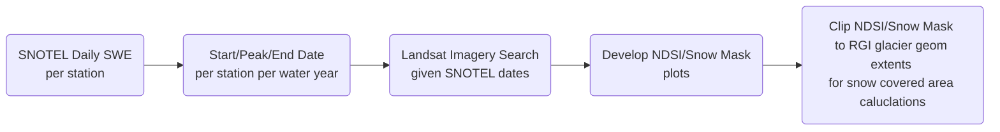

# Mt. Baker Glacier Exploration

#### Sydney Carr, UW GDA W2022
Workflow utilizing SNOTEL data and Landsat imagery to quantitatively and qualitatively explore changes in snow and ice cover on Mt. Baker glaciers over time.

## Background Information

Mount Baker is a 10,781 ft glacier-covered stratovolcano in Washington’s North Cascades with 1.79 km3 of volumetric snow and ice cover. Mount Baker has sixteen named glaciers, the largest being the Coleman Glacier with a surface area of 5.2 km2. For this workflow, the Talum Glaciers are considered to be one glacier.

Glacial mass balance is dependent on snow accumulation and snow melt. At higher elevations, snowfall in the accumulation zone becomes glacier ice over time. At lower elevations, winter snow and glacier ice melt in the ablation zone. Between the accumulation and ablation zones, an equilibrium line can be determined to assess how a glacier is advancing or receding. Glaciers are susceptible to changes in precipitation and temperature, and physical changes over time are therefore an important indicator of climate change.

Four SNOTEL stations surround Mt. Baker:
  * SNOTEL:909_WA_SNTL, Elev. 4,030 ft  
  * SNOTEL:910_WA_SNTL, Elev. 3,040 ft  
  * SNOTEL:999_WA_SNTL, Elev. 3,520 ft  
  * SNOTEL:1011_WA_SNTL, Elev. 4,970 ft  

## Objectives

Evaluate glacial trends over time both quantitatively and qualitatively, and investigate the relationship between SNOTEL station data and Landsat spatial data specific to measuring glacier mass on Mt. Baker. 
  
* Use SNOTEL station data from the four stations surrounding Mt. Baker to develop descriptive time series for the annual snowpack.
  * Are there any trends in this data?
* Use Landsat imagery to spatially determine the glacial accumulation and ablation zones, and establish an equilibrium line.   
  * Is the equilibrium line advancing or receding over time?
* Can a relationship be established between the results of the SNOTEL and Landsat analyses?

## Tools/Packages

* Pandas
* Geopandas
* Shapely
* Numpy
* Scipy
* Matplotlib
* Rasterio  
* Pystac_client & planetary_computer (Landsat download)

## Data Downloads & Initial Set Up

#### SNOTEL [/final-project/snotel_download.ipynb](https://github.com/UW-GDA/When-Glaciers-Were-Cool/blob/main/final-project/snotel_download.ipynb)
Download daily snow water equivalent measurements from the four SNOTEL stations and optimize geographic location/elevation information.

#### Landsat Imagery [/final-project/LS8_download.ipynb](https://github.com/UW-GDA/When-Glaciers-Were-Cool/blob/main/final-project/LS8_download.ipynb)
Use dates from SNOTEL analysis to narrow annual search window and download cloud-free imagery for the start, peak, and end of the annual snowpack. *Availability of cloud-free imagery given specific dates was the most limiting factor in this analysis.*  

#### Randolph Glacier Inventory (RGI) [/final-project/rgi_download.ipynb](https://github.com/UW-GDA/When-Glaciers-Were-Cool/blob/main/final-project/LS8_download.ipynb) 
Source: http://www.glims.org/RGI/  
Download the WesternCanadaUS.shp shapefile from RGI and establish an area of interest coordinate box surrounding the extents of Mt. Baker.  
Filter for all named glaciers intersecting the area of interest. This yeilds 14 glaciers (the Talum Glaciers are one polygon). 
Save final geodataframe as a GeoJSON for future analysis.

## Methodology

#### SNOTEL [/final-project/snotel_stats.ipynb](https://github.com/UW-GDA/When-Glaciers-Were-Cool/blob/main/final-project/snotel_stats.ipynb)
Caluclate the water year and day of water year for each data point and determine the start, peak, and end of the annual (water year) snowpack.  
* Start: Last day of 0" SWE during accumulation period  
* Peak: Day of maximum SWE  
* End: First day of 0" SWE during melt period

Shifts in the start/peak/end dates can be indicators of the snowpack's response to climate change. This can be used to infer trends in the annual snowpack such as a shorter snow season, earlier melt period and shorter accumulation period, or changes in melt period and melt rate. 

Develop a time series at each station for start, peak, and end of the annual (water year) snowpack. Calculate the linear regression for each time series and observe any trends in the datasets.  

#### Landsat Imagery [/final-project/L8_workbook](https://github.com/UW-GDA/When-Glaciers-Were-Cool/blob/main/final-project/L8_workbook.ipynb)
Landsat imagery allows for spatial analysis of glacial snow and ice cover whereas the SNOTEL stations capture point data measurements at locations/elevations that vary significantly to the location/elevation of glaciers on Mt. Baker.

Compile and process start/peak/end date imagery for each water year within the scope of analysis.

Develop NDSI plots and create a 'snow mask' to isolate snow covered area.

Clip the snow mask to the RGI glacier geometry and calculate the snow covered area.

## Future Work

#### Glacier Equilibrium Line & Snow Covered Area
*Was not originally planned for 'future' work...'*
* Compile a larger dataset of annual imagery for dates ranging from pre-'start of snowpack' date (summer) to 'start of snowpack' date to capture glacial mass (ice versus seasonal snowpack) 
  * The date range is to account for limited Landsat data availability 
* Clip the NDSI/snow mask plots to the RGI glacier geometry and calculate snow covered area
* Develop a time series to evaluate trends (expansion or recession) over time 
 
#### Accumulation & Melt Period Per Aspect
* Identify and gorup north versus south facing glaciers and associated SNOTEL stations  
* Explore Sentinel-2 satellite imagery alternative: 5-day resolution, starts around 2017  
* Determine an appropriate 'buffer' about the RGI glacier geometry to capture approximate extents of the accumulation and ablation zones. Use new geometry to clip NDSI/snow mask plots and measure loss of snow covered area over time to calculate the accumulation rate (start of SWE to peak SWE) and melt rate (peak SWE to end of SWE, peak SWE to late summer/early fall)
* Calculate the accumulation rate at SNOTEL stations (start of SWE to peak SWE) and melt rate (peak SWE to end of SWE)
* Compare imagery results to station results 
* Couple with temperature and precipitation time series from SNOTEL station data

## Future Development
Develop user-friendly workflows that can deliver a standalone presentation of results.  
* Current workflow lacks documentation/instruction and is best presented by exporting results to a new notebook or to an external platform such as powerpoint  
* Landsat Analysis notebooks are inefficient when applied to larger volumes of imagery

