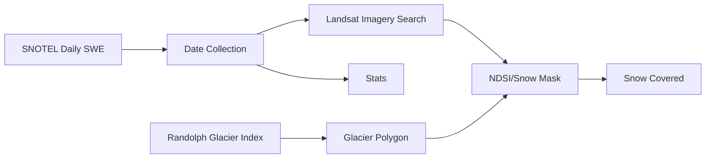

# When-Glaciers-Were-Cool
A workflow involving Landsat and SNOTEL data to visualize and evaluate changes in snow and ice cover on Mt. Baker over time.

Sydney Carr

## Background Information


Mount Baker is a 10,781 ft glacier-covered stratovolcano in Washington’s North Cascades with 1.79 km3 of volumetric snow and ice cover. Mount Baker has sixteen named glaciers, the largest being the Coleman Glacier with a surface area of 5.2 km2. 

Glacial mass balance is dependent on snow accumulation and snow melt. At higher elevations, snowfall in the accumulation zone becomes glacier ice over time. At lower elevations, winter snow and glacier ice melt in the ablation zone. Between the accumulation and ablation zones, an equilibrium line can be determined to assess how a glacier is advancing or receding. Glaciers are susceptible to changes in precipitation and temperature, and physical changes over time are an important indicator of climate change.

Four SNOTEL stations surround Mt. Baker:
  * SNOTEL:909_WA_SNTL, Elev. 4,030 ft  
  * SNOTEL:910_WA_SNTL, Elev. 3,040 ft  
  * SNOTEL:999_WA_SNTL, Elev. 3,520 ft  
  * SNOTEL:1011_WA_SNTL, Elev. 4,970 ft  


## Objectives

To evaluate glacial trends over time both quantitatively and qualitatively, and to explore the relationship between SNOTEL station data and glacial mass on Mt. Baker.  
  
Use Landsat imagery to visualize the glacial accumulation zone and ablation zone, and establish an equilibrium line.   
Is the equilibrium line advancing or receding over time?

Use SNOTEL datasets from the four stations at Mount Baker to build an annual snow accumulation and snowmelt timeseries.  
Is this consistent with accumulation and ablation observed from Landsat imagery? 


## Tools/Packages

* Rasterio  
* Numpy  
* Scipy
* Matplotlib  
* Geopandas

## Data Downloads and Initial Set Up

#### SNOTEL ```/final-project/snotel_stats.ipynb```
Download daily snow water equivalent measurements from the four SNOTEL stations and determine the start, peak, and end of the annual (water year) snowpack.  
* Start: Last day of 0" SWE during accumulation period  
* Peak: Day of maximum SWE  
* End: First day of 0" SWE during melt period

#### Landsat Imagery ```/final-project/LS8_download```
Use dates from SNOTEL analysis to narrow annual search window and download cloud-free imagery for the start, peak, and end of the annual (water year) snowpack.  
*This was the most limiting factor in this analysis.*  


#### Randolph Glacier Inventory (RGI) ```/final-project/rgi_download.ipynb```
Download the WesternCanadaUS.shp shapefile from RGI and establish an area of interest coordinate box surrounding the extents of Mt. Baker.  
Filter for all named glaciers intersecting the area of interest. This yeilds 14 glaciers (the Talum Glaciers are one polygon). 
Save final geodataframe as a GeoJSON for future analysis.

## Methodology

#### SNOTEL ```/final-project/snotel_stats.ipynb```
Shifts in the start/peak/end dates can be indicators of the snowpack's response to climate change.  shorter accumulation periods, faster melting periods, sh

Develop a time series at each station for start, peak, and end of the annual (water year) snowpack. Calculate the linear regression for each time series and observe any trends in the datasets.  

#### Landsat Imagery NOTEBOOK
Because there is so much variation between the locations/elevations of the SNOTEL stations and the extents of the glaciers on Mt. Baker, Landsat imagery allows for analysis to be conducted on glacial snow and ice.

Calculate the NDSI for the image and create a 'snow mask'.


Crop 'snow mask' to rgi glacier geometry and calculate the snow covered area.


## Future Work



